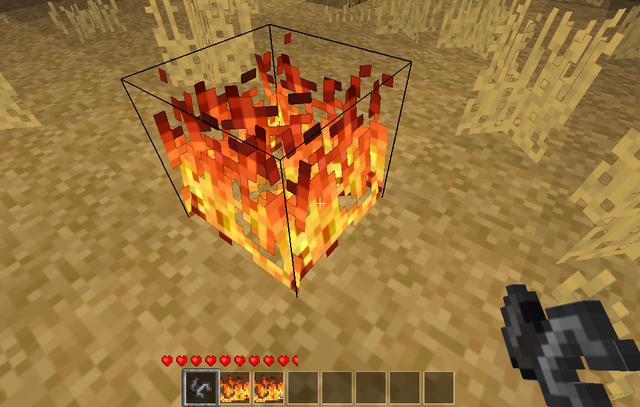

minetest mod fire
==========================

Fire featured mod

Information
-----------

This mod is named `fire`, it features work from original mod.
This is improved for Chest drops and /fire (on|off) command too to 
disable propagation of fire destruction.

Technical informaton
--------------------

#### Dependencies

* default

#### Configuration

* `enable_fire` - taken from minetest config file, bool type
* `disable_fire` - taken from minetest config file, bool type

The `disable_fire` is checked only if `enable_fire` is not defined, 
if configure enables or disables usage of fire and flames.

#### nodes and tools

| Name            | node                 | notes |
| --------------- | -------------------- | ----- |
| Basic flame     | fire:basic_flame     | it flames fro a while |
| Permanent flame | fire:permanent_flame | always flaming |
| Flint and Steel | fire:flint_and_steel | it burns flamable things |

#### chat command

| Command format   | Description                            | privilegies need |
| ---------------- | -------------------------------------- | ---------------- |
| `/fire <on|off>` | Disbles fire spreading when set to OFF | server           |

Licence
------

**Source code**

Originally by Perttu Ahola (celeron55) <celeron55@gmail.com> (LGPL 2.1)
Various Minetest developers and contributors (LGPL 2.1)
Chest drops and /fire (on|off) command additions by TenPlus1 (MIT)

**Media (textures and model)**

Everything not listed in here:
Copyright (C) 2012 Perttu Ahola (celeron55) <celeron55@gmail.com> (CC BY-SA 3.0)

Muadtralk (CC BY-SA 3.0)
  fire_basic_flame_animated.png

Gambit (CC BY-SA 3.0)
  fire_flint_steel.png

dobroide (CC BY 3.0)
http://www.freesound.org/people/dobroide/sounds/4211/
  fire_small.ogg

Dynamicell (CC BY 3.0)
http://www.freesound.org/people/Dynamicell/sounds/17548/
  fire_large.ogg
  fire_fire.*.ogg

fire_small.ogg and fire_large.ogg are unused but kept temporarily to not break
other mods that may use them.

Benboncan (CC BY 3.0)
https://www.freesound.org/people/Benboncan/sounds/66457/
  fire_flint_and_steel.ogg

Check [lisence.txt](lisence.txt)
